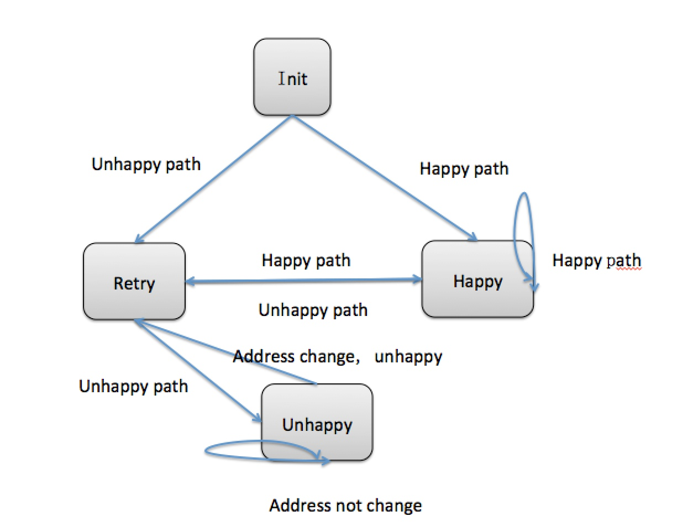

 
      最近在为澳洲一家保险公司做web应用，在一个收集用户地址信息的页面中，我遇到了一个问题：

1. 当用户输入正确的地址，通过验证。
2. 当用户第一次输入错误的地址，不通过
3. 当用户第二次输入，不论正确与否，都将通过。
4. 当用户通过后返回上一个页面如果地址没有修改，通过。
5. 当用户通过后返回上一个页面，地址修改，但不正确，不通过。

有了这两个变量，我就可以在做验证的时候来通过判断这两个变量的值来决定是否调用验证方法。
第一次验证，和第二次验证都可以实现，但是当我想要实现从下个页面跳回上个页面的时候，我的验证逻辑完全失效了，很明显简单的if else和变量已经让整个程序变得臃肿不堪，逻辑混乱。

但经过仔细分析之后，我们可以把用户验证的状态分为：init, happy, retry, unhappy 四个状态来判断是否进行地址信息的验证。如下图所示：
当面对这样的需求的时候，我立马有了解决方案，首先要有一个全局变量来保存他输入的地址是否正确的boolean,然后还得有一个session里存放一个地址变量，来比较地址是否改变。

通过分析得出四种状态根据isHappyPath来决定自己状态的变化，以及决定页面的跳转。

由此可抽象出状态类


    public abstract class State {
        public abstract void changeState(boolean isHappyPath, StateContext stateContext);
    }

    public class HappyPath extends State {
        @Override
        public void changeState(boolean isHappyPath, StateContext stateContext) {
            if(!isHappyPath){
    　　　　　　　errors.reject("address is wrong");　
                stateContext.setState(new Retry());
            }
        }
    }

    public class Retry extends State {
        @Override
        public void changeState(boolean isHappyPath, StateContext stateContext){
            if(isHappyPath){
                stateContext.setState(new HappyPath());
            } else {
            　　stateContext.setState(new UnhappyPath());
    　　　　 }　
        }
    }

    public class UnhappyPath extends State{
        @Override
        public void changeState(boolean isHappyPath, StateContext stateContext){
            if(isHappyPath) {
                stateContext.setState(new HappyPath());
            } else if(stateContext.isAddressChanged()){
    　　　　　　 errors.reject("address is wrong");
               stateContext.setState(new Retry());
            }
        }
    }


在设计好状态类和如何切换状态之后，状态机container的具体实现如下：


    public class StateContext {
        private State state = new Init();

        public void setState(State state) {
            this.state = state;
        }

        public void changeState(Address address) {
            state.changeState(isHappyPath(address), this);
        }

        public boolean isHappyPath(Address address){
            return addressValidator(address);
        }
    }



如此简单的几个类就构成了状态机的实现，方便处理了逻辑的转化以及页面跳转的规则。State模式在实际使用中比较多,适合"状态的切换".因为我们经常会使用If elseif else 进行状态切换, 如果针对状态的这样判断切换反复出现,我们就要联想到是否可以采取State模式了.

希望能对大家有帮助。